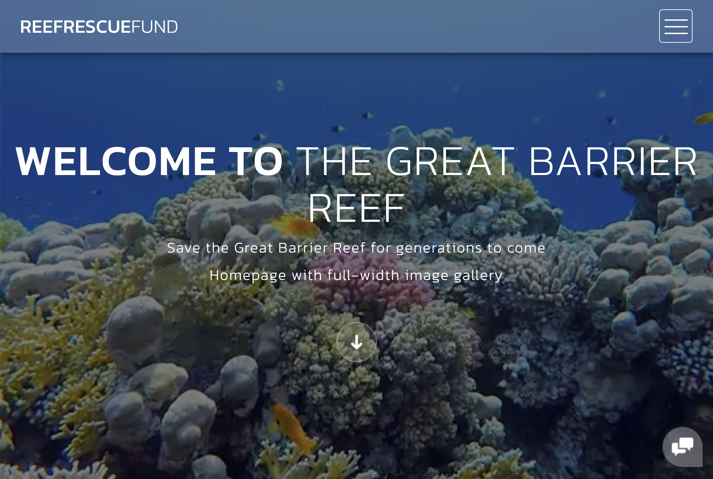
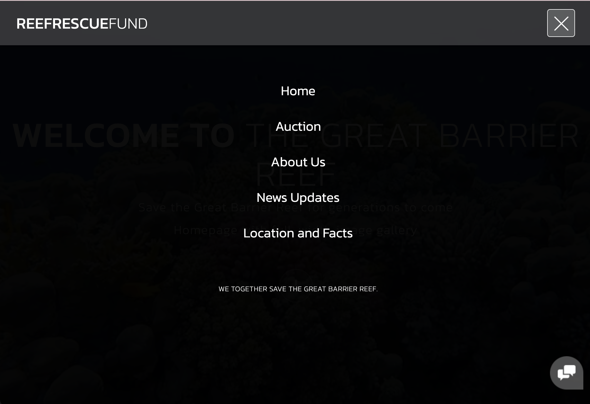
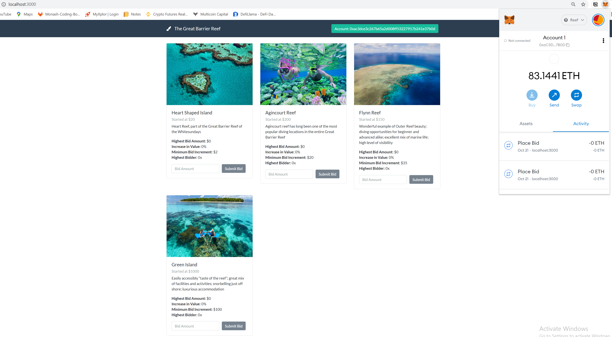
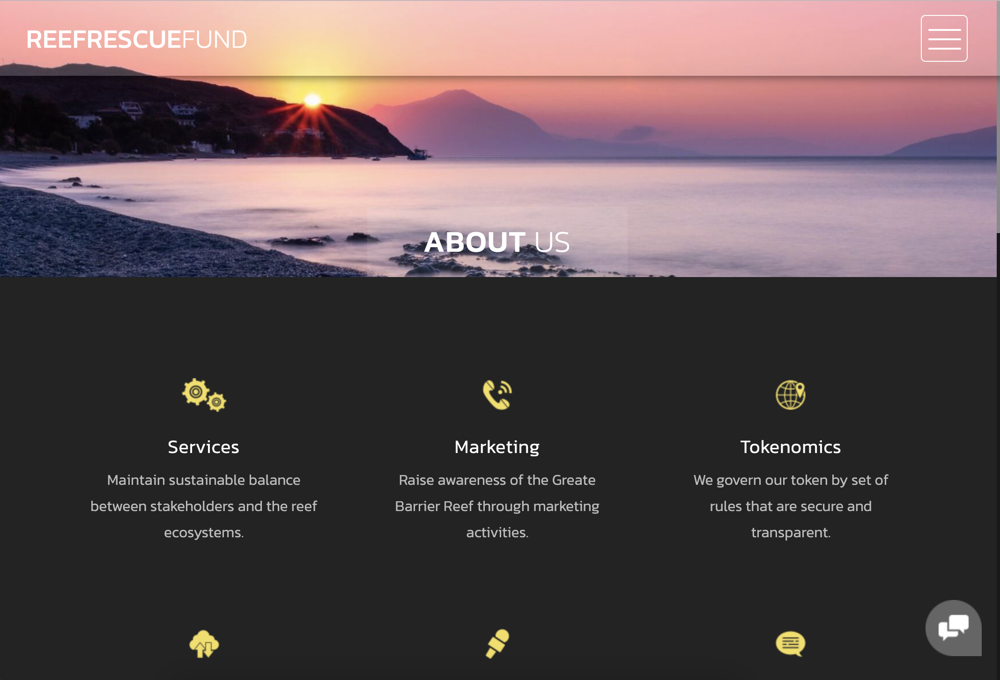
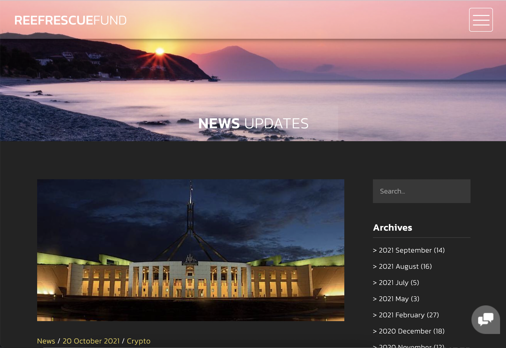
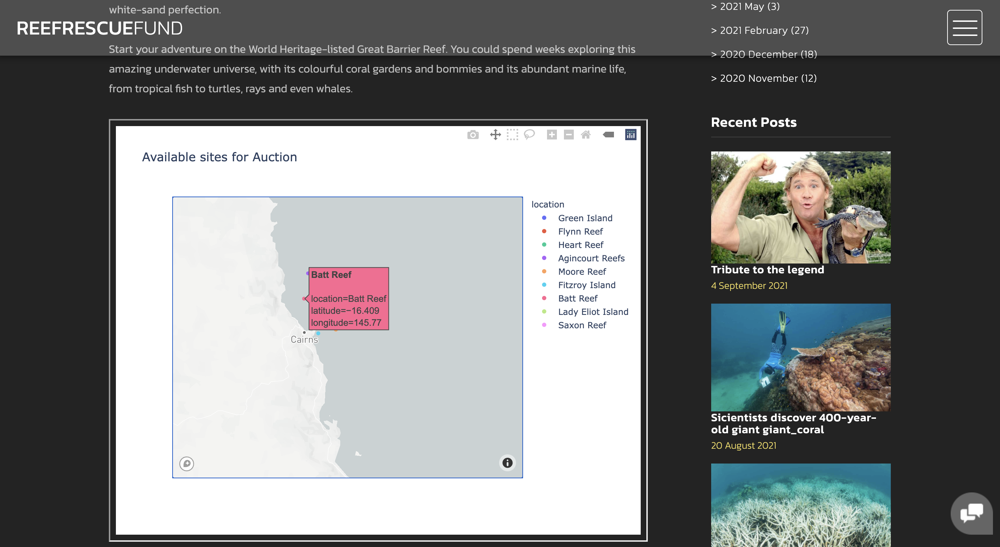
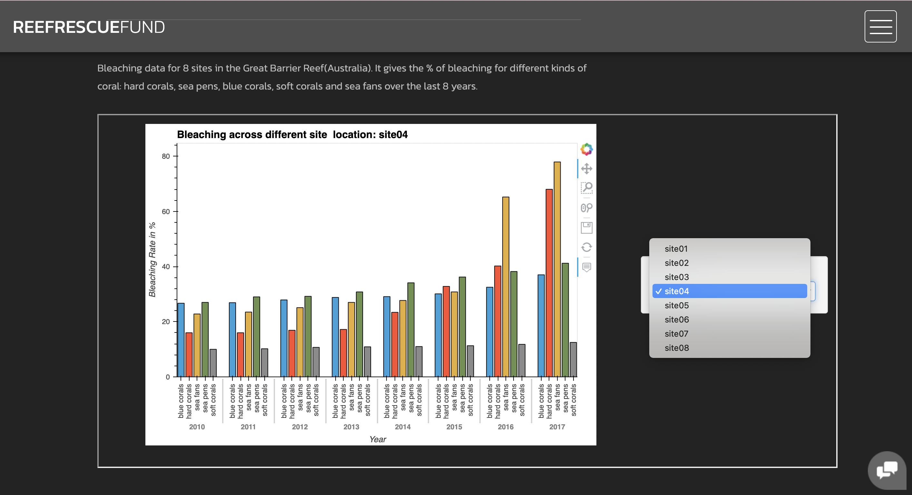
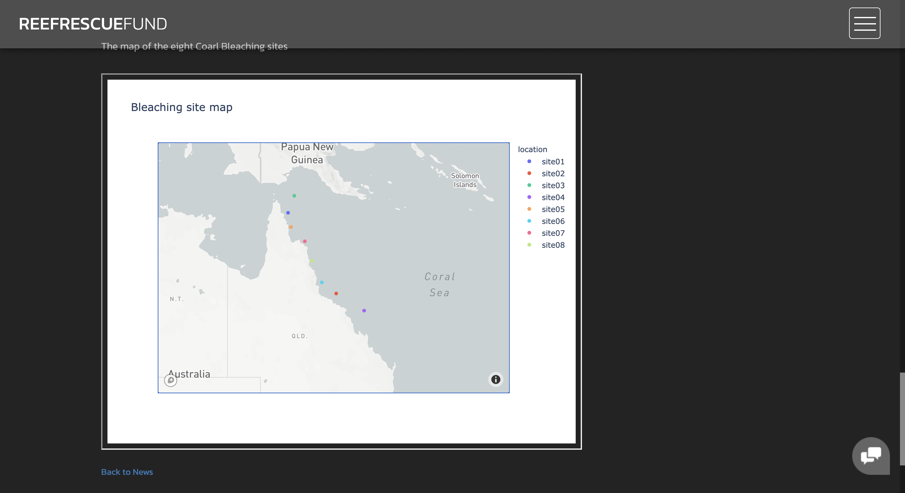

# ReefRescueFund - website The Great Barrier Reef 
## Interactive website

## Development Enviroment
Core technologies used in the website:
- html
- CSS
- JavaScript
- Python
- Plotly
- hvPlot

### Main page
An animated fullscreen background with a full image view of all availabe auction sites.

### Selection page
From menu icon to display selection page.

### Auction page
Linked with Localhost index.html inside src folder and supporting files with smart contract operation. 

### About us and News page

### Location and Facts page 

 Location of all the auction sites. 

Bleaching data of 8 different locations in the Great Barrier Reef. The graph is grouped by locations and can be selected from HvPlot dropdown menu on the left side of the screen. 

